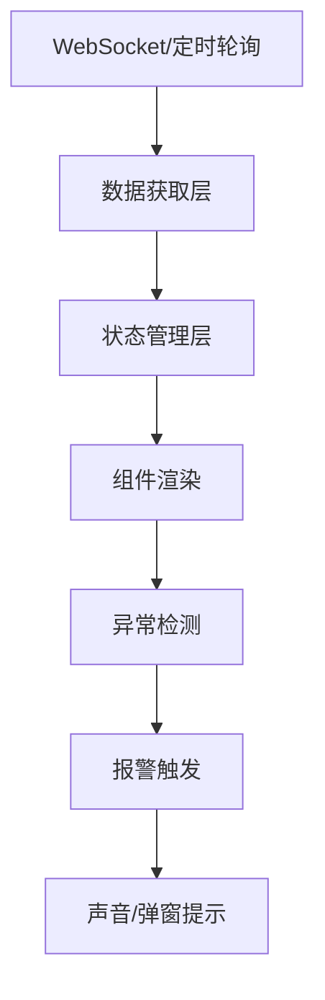
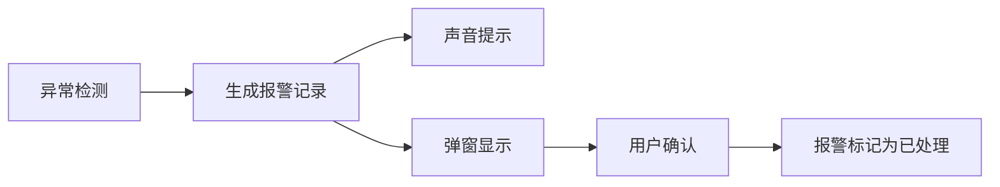

## 1. 产品概述

干洗中央工厂洗护流水线实时监控看板系统，用于直观展示生产运营数据与设备状态，帮助管理人员实时掌握生产进度、及时发现异常、提升运营效率。

- 目标用户：工厂管理人员、生产调度员、设备维护人员
- 核心价值：实时可视化监控、异常预警、数据驱动决策

## 2. 核心功能

### 2.1 用户角色

| 角色 | 登录方式 | 核心权限 |
|------|----------|----------|
| 管理员 | 账号登录 | 查看全部监控数据、配置报警阈值、确认报警 |
| 操作员 | 账号登录 | 查看负责工位的状态与报警信息 |

### 2.2 功能模块

1. **工序处理量监控**：实时展示各工序今日处理件数
2. **产线运行状态监控**：人工作业线工位状态 + 设备运行线进度
3. **异常报警系统**：衣物停留超时报警 + 设备故障报警
4. **生产数据统计**：今日产能对标 + 品类合格率统计

### 2.3 页面详情

| 页面名称 | 模块名称 | 功能描述 |
|----------|----------|----------|
| 监控看板主页 | 工序处理量卡片 | 显示收衣待分拣、预处理、主洗、后整、质检、已完成6个工序的今日处理量，支持30-60秒自动刷新 |
| 监控看板主页 | 人工作业线 | 以工位卡片形式展示各工位操作员实时状态（空闲/忙碌），绿色表示空闲，蓝色表示忙碌 |
| 监控看板主页 | 设备运行线 | 展示干洗机/水洗机/烘干机/烫台的运行进度、当前批次、剩余时间，状态包含运行/待机/故障 |
| 监控看板主页 | 异常报警面板 | 衣物停留超时条目标红显示，设备故障弹窗报警，支持声音提示与手动确认 |
| 监控看板主页 | 生产统计 | 今日产能对标进度条，品类合格率饼图/柱状图 |

## 3. 核心流程

### 3.1 数据更新流程

### 3.2 报警处理流程

## 4. 用户界面设计

### 4.1 设计风格

- **主色调**：深色工业风，以深灰/炭黑为底色（#0f172a / #1e293b）
- **强调色**：
  - 运行/正常：青色 #06b6d4
  - 空闲：绿色 #22c55e
  - 忙碌：蓝色 #3b82f6
  - 报警/故障：红色 #ef4444
  - 待机：琥珀色 #f59e0b
- **字体**：采用等宽数字字体展示数据，增强工业感；正文使用无衬线字体
- **布局**：卡片式网格布局，信息分区明确
- **视觉元素**：数据高亮、脉冲动画、进度条、状态指示灯

### 4.2 页面设计概览

| 页面名称 | 模块名称 | UI元素 |
|----------|----------|--------|
| 监控看板主页 | 顶部标题栏 | 工厂名称、实时时钟、刷新状态指示 |
| 监控看板主页 | 工序处理量区 | 6个横向排列的数据卡片，含数字、标签、趋势箭头 |
| 监控看板主页 | 产线状态区 | 左右分栏：左侧人工作业线工位网格，右侧设备列表卡片 |
| 监控看板主页 | 报警统计区 | 报警数量汇总 + 实时报警列表 |
| 监控看板主页 | 数据分析区 | 产能进度条 + 合格率图表 |

### 4.3 响应式设计

- 桌面端（>1200px）：四栏布局，完整展示所有模块
- 平板端（768-1200px）：两栏布局，模块重新排列
- 移动端（<768px）：单列垂直滚动布局，优先展示核心数据

### 4.4 动效设计

- 数据更新时数字平滑过渡动画
- 报警项闪烁脉冲效果
- 设备进度条实时增长动画
- 页面加载骨架屏效果
