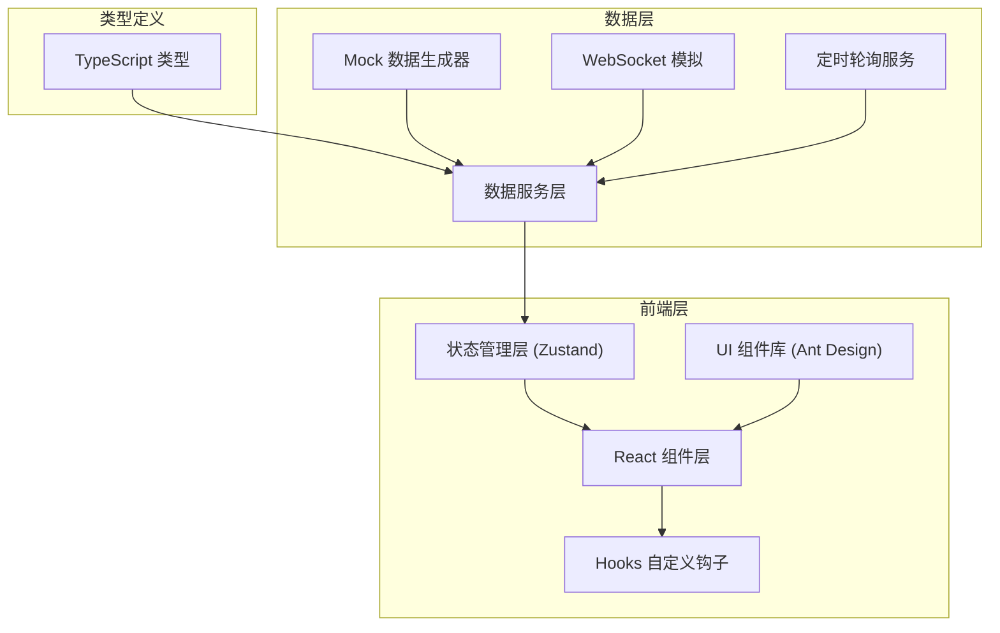

## 1. 架构设计



## 2. 技术描述

- **前端框架**：React 18 + TypeScript
- **构建工具**：Vite 5
- **UI 组件库**：Ant Design 5
- **样式方案**：Tailwind CSS 3 + CSS Variables
- **状态管理**：Zustand
- **图表库**：echarts-for-react / recharts
- **图标库**：Lucide React
- **数据刷新**：setInterval 定时轮询 + WebSocket 模拟
- **后端**：无真实后端，使用 Mock 数据模拟

## 3. 项目结构

```
src/
├── components/          # 可复用组件
│   ├── ProcessCard.tsx     # 工序数据卡片
│   ├── WorkstationCard.tsx # 工位状态卡片
│   ├── EquipmentCard.tsx   # 设备状态卡片
│   ├── AlarmItem.tsx       # 报警条目
│   ├── AlarmModal.tsx      # 报警弹窗
│   ├── ProgressBar.tsx     # 进度条
│   └── StatsChart.tsx      # 统计图表
├── pages/               # 页面
│   └── Dashboard.tsx       # 监控看板主页
├── hooks/               # 自定义 Hooks
│   ├── useWebSocket.ts     # WebSocket 连接钩子
│   ├── useInterval.ts      # 定时轮询钩子
│   └── useAlarmSound.ts    # 报警声音钩子
├── store/               # 状态管理
│   └── dashboardStore.ts   # 看板数据 Store
├── types/               # 类型定义
│   └── index.ts            # 类型定义文件
├── utils/               # 工具函数
│   ├── mockData.ts         # Mock 数据生成
│   └── formatters.ts       # 格式化工具
├── App.tsx
├── main.tsx
└── index.css
```

## 4. 数据类型定义

```typescript
// 工序类型
type ProcessType = 'receiving' | 'pretreatment' | 'washing' | 'finishing' | 'inspection' | 'completed';

// 工序数据
interface ProcessData {
  id: ProcessType;
  name: string;
  count: number;
  trend: 'up' | 'down' | 'stable';
  trendValue: number;
}

// 工位状态
type WorkstationStatus = 'idle' | 'busy';

interface Workstation {
  id: string;
  name: string;
  operator: string;
  status: WorkstationStatus;
  currentTask?: string;
  startTime?: string;
}

// 设备状态
type EquipmentStatus = 'running' | 'standby' | 'fault';

interface Equipment {
  id: string;
  name: string;
  type: 'dryer' | 'washer' | 'drying_rack' | 'ironing';
  status: EquipmentStatus;
  currentBatch?: string;
  itemCount?: number;
  progress: number; // 0-100
  remainingMinutes?: number;
  faultMessage?: string;
}

// 报警类型
type AlarmType = 'timeout' | 'equipment_fault';
type AlarmLevel = 'warning' | 'danger';

interface Alarm {
  id: string;
  type: AlarmType;
  level: AlarmLevel;
  title: string;
  message: string;
  location: string;
  timestamp: string;
  acknowledged: boolean;
  suggestion?: string;
}

// 品类合格率
interface CategoryPassRate {
  category: string;
  passRate: number;
  total: number;
  passed: number;
}

// 产能数据
interface ProductionData {
  targetCount: number;
  completedCount: number;
  passRate: number;
  categories: CategoryPassRate[];
}

// 看板完整数据
interface DashboardData {
  processes: ProcessData[];
  workstations: Workstation[];
  equipments: Equipment[];
  alarms: Alarm[];
  production: ProductionData;
  lastUpdate: string;
}
```

## 5. 核心数据接口

### 5.1 获取看板数据

```typescript
// GET /api/dashboard
// Response: DashboardData
```

### 5.2 WebSocket 实时推送

```typescript
// 连接: ws://localhost/dashboard
// 推送消息类型:
interface WSMessage {
  type: 'process_update' | 'workstation_update' | 'equipment_update' | 'new_alarm';
  data: ProcessData | Workstation | Equipment | Alarm;
}
```

### 5.3 确认报警

```typescript
// POST /api/alarms/:id/acknowledge
// Response: { success: boolean }
```

## 6. 状态管理设计

使用 Zustand 管理全局状态，包含：

- 看板完整数据
- 加载状态
- 报警弹窗状态
- 报警声音开关
- 自动刷新间隔配置
